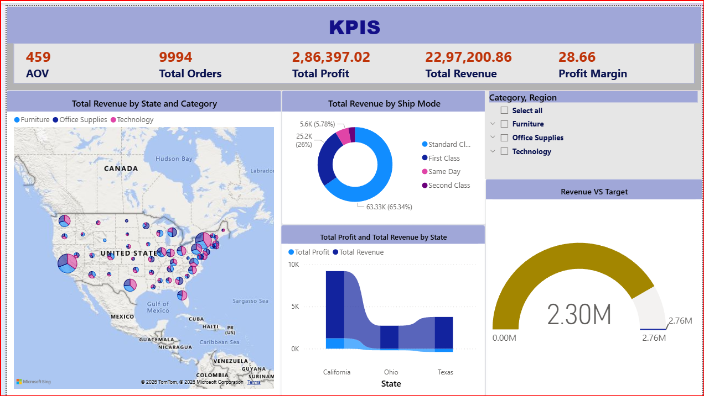
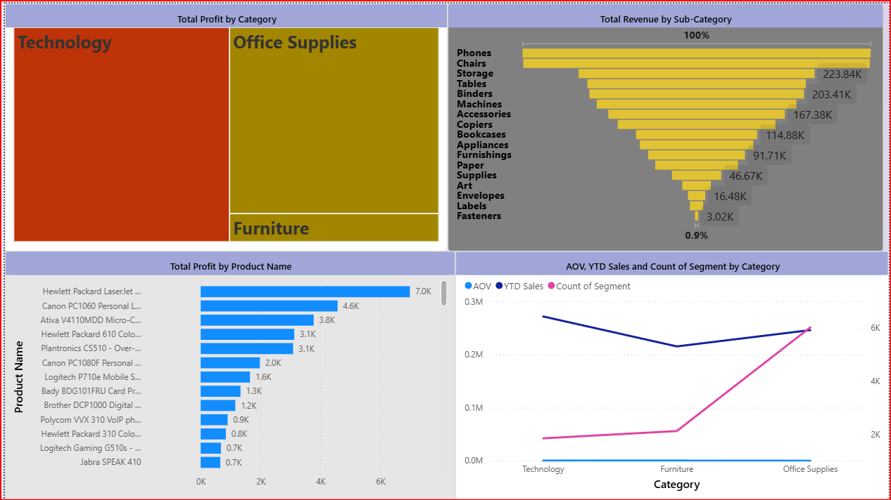
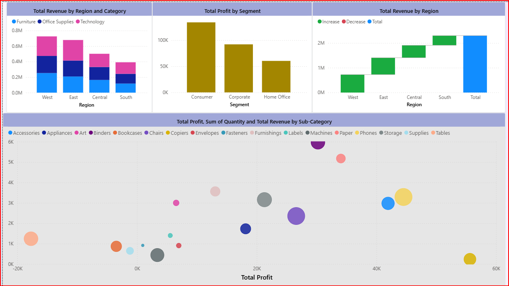
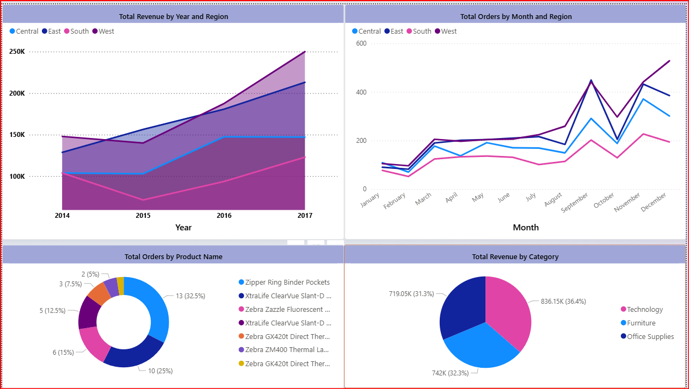

# 📊 Retail Sales Analysis — End-to-End Data Analytics Project

> An end-to-end sales analytics project using **Python, SQL, and Power BI** to analyze sales performance, profitability, customer behavior, product performance, regional trends, and business KPIs.


---

## 📋 Table of Contents

- [Project Overview](#project-overview)
- [Business Problem & Objectives](#business-problem--objectives)
- [Dataset Overview](#dataset-overview)
- [Technical Stack](#technical-stack)
- [Project Structure](#project-structure)
- [Data Preparation](#data-preparation)
- [SQL Analysis](#sql-analysis)
- [Python EDA](#python-eda)
- [Customer Analysis](#customer-analysis)
- [Key Findings & Insights](#key-findings--insights)
- [Power BI Dashboard](#power-bi-dashboard)
- [Key Metrics & KPIs](#key-metrics--kpis)
- [Methodology](#methodology)
- [Business Recommendations](#business-recommendations)
- [How to Run](#how-to-run)
- [Future Enhancements](#future-enhancements)
- [Author](#author)

---

## 🎯 Project Overview

This project demonstrates a complete data analytics workflow from prepared sales data to business reporting.

The analysis focuses on:

- Sales and profit performance
- Monthly sales trends
- Category and sub-category performance
- Product profitability
- Regional performance
- Customer purchasing behavior
- Repeat customers
- Customer segmentation
- Funnel and cohort/retention analysis
- Interactive Power BI reporting

### Workflow

**Dataset → Python Data Preparation & EDA → SQL Business Analysis → Power BI Dashboard → Business Insights**

---

## 💼 Business Problem & Objectives

A sales organization needs to understand what is driving revenue and profit, which customers are valuable, where performance is strongest or weakest, and where customer behavior may require attention.

### Objectives

1. Measure overall sales and profitability.
2. Identify high- and low-performing products and categories.
3. Compare regional and monthly performance.
4. Understand customer purchasing behavior.
5. Identify repeat and one-time customers.
6. Analyze customer activity over time.
7. Build an interactive dashboard for stakeholder reporting.
8. Convert analytical findings into business-focused recommendations.

---

## 📊 Dataset Overview

The analyzed dataset contains:

| Metric | Value |
|---|---:|
| Sales Records | **9,694** |
| Unique Orders | **4,931** |
| Unique Customers | **793** |

### Key Data Areas

- Order and shipping dates
- Customer ID and customer name
- Segment
- Region, state, and city
- Category and sub-category
- Product
- Sales
- Quantity
- Discount
- Profit

Additional analytical fields were prepared for time-based and reporting analysis.

---

## 🛠️ Technical Stack

| Technology | Purpose |
|---|---|
| Python | Data preparation and EDA |
| Pandas | Data manipulation |
| NumPy | Numerical analysis |
| Matplotlib | Visualization |
| Seaborn | Exploratory visualization |
| MySQL | Business analysis with SQL |
| Power BI | Dashboard and reporting |
| Jupyter Notebook | Python analysis |
| GitHub | Version control and documentation |

---

## 📁 Project Structure

```text
Enterprise-Level-Sales-Analysis/
│
├── DATASET/
│   └── cleaned_sales_dataset.csv
│
├── NOTEBOOK/
│   └── Sales_Analysis.ipynb
│
├── SQL/
│   └── Sales_Analysis.sql
│
├── POWER_BI/
│   ├── Dashboard_Overview.png
│   ├── Customer_Analysis.png
│   ├── Sales_Analysis.png
│   └── [Add remaining screenshots]
│
└── README.md
```


## 🧹 Data Preparation

Python was used to inspect and prepare the dataset before analysis.

### Data Quality Checks

- Checked data types
- Checked missing values
- Validated duplicate rows
- Checked unique orders and customers
- Reviewed sales, discount, and profit values
- Prepared date-related fields
- Created analytical fields required for reporting

### Important Validation

Duplicate **rows** and duplicate **Order IDs** were treated differently.

An Order ID can appear on multiple rows because one order may contain multiple products/line items. Therefore, Order ID duplication was not automatically treated as a data-quality error.

---

## 🐍 Python EDA

Exploratory analysis was performed using Pandas, Matplotlib, and Seaborn.

Areas analyzed included:

- Sales distribution
- Profit distribution
- Monthly sales trends
- Category performance
- Regional performance
- Product profitability
- Customer order behavior
- Customer activity over time

---

## 🗄️ SQL Analysis

SQL was used to answer business questions such as:

- What are total sales and profit?
- Which categories generate the most revenue?
- Which products generate losses?
- Which regions perform best?
- How does sales performance change by month?
- Who are the highest-value customers?
- How many customers are repeat customers?
- What is the customer distribution by order frequency?
- How does customer activity change over time?

The SQL layer converts raw transaction-level data into business-ready metrics.

---

## 👥 Customer Analysis

### Repeat Customer Definition

For this project, a repeat customer is defined as:

> **A customer with more than one unique Order ID.**

### Results

| Customer Metric | Result |
|---|---:|
| Total Customers | **793** |
| One-Time Customers | **12** |
| Repeat Customers | **781** |
| Repeat Customer Rate | **98.49%** |

### Order Frequency Distribution

Customers were also analyzed by number of unique orders.

The distribution showed that most customers placed multiple orders, while only a small number placed a single order.

### Customer Activity Over Time

Monthly unique-customer analysis showed:

- Overall customer activity increased over the analyzed period.
- Higher customer activity was consistently visible around **September and November–December**.
- The analysis provides a basis for deeper cohort and retention analysis.

---

## 🔍 Key Findings & Insights

### 1. Customer Retention Behavior

**781 of 793 customers** placed more than one unique order, resulting in a **98.49% repeat-customer rate** under the project's definition.

### 2. Customer Activity

Customer activity increased across the analyzed period, with noticeable seasonal peaks around September and November–December.

### 3. Profitability

The project evaluates profit alongside sales because high-revenue transactions do not necessarily produce high profit.

### 4. Product and Category Performance

Product-, category-, and sub-category-level analysis helps identify strong contributors as well as products/categories requiring profitability review.

### 5. Regional Performance

Regional analysis compares sales and profit across geographic areas to identify stronger and weaker markets.

---

## 📈 Power BI Dashboard

The Power BI report is designed as an interactive business reporting layer.


---

## 📊 Dashboard Preview
### 🔹 Overview


### 🔹 Profit Analysis


### 🔹 Revenue Analysis


### 🔹 Sales Trend



---

## 🔑 Key Metrics & KPIs

| KPI | Value |
|---|---:|
| Sales Records | **9,694** |
| Unique Orders | **4,931** |
| Unique Customers | **793** |
| Repeat Customers | **781** |
| Repeat Customer Rate | **98.49%** |

Other dashboard KPIs include sales, profit, quantity, discount, category performance, regional performance, and customer metrics.

---

## 🔬 Methodology

### Phase 1 — Data Preparation

- Data inspection
- Quality validation
- Date preparation
- Duplicate validation
- Feature preparation

### Phase 2 — Exploratory Data Analysis

- Univariate analysis
- Trend analysis
- Category analysis
- Customer analysis
- Profitability analysis

### Phase 3 — SQL Analysis

- Aggregations
- Grouping
- Joins
- Customer analysis
- Product analysis
- Time-based analysis

### Phase 4 — Business Insight

- Identify important trends
- Compare segments
- Investigate unusual results
- Translate findings into business implications

### Phase 5 — Power BI

- Data modeling
- KPI creation
- Interactive visuals
- Filters and slicers
- Dashboard storytelling

---

## 💡 Business Recommendations

Based on the analysis framework, stakeholders can:

- Monitor repeat-customer behavior.
- Investigate products with weak profitability.
- Focus on high-value customer segments.
- Monitor seasonal sales patterns.
- Compare regional performance regularly.
- Use profit, not revenue alone, when evaluating product performance.

---

## 🚀 How to Run

### Python

```bash
pip install pandas numpy matplotlib seaborn jupyter
jupyter notebook
```

Open the notebook in the `NOTEBOOK` folder.

### SQL

1. Create a MySQL database.
2. Import the prepared sales dataset.
3. Run the SQL scripts.
4. Execute the business-analysis queries.

### Power BI

Open the `.pbix` report in Power BI Desktop and refresh the data source if required.

---

## 🔮 Future Enhancements

- Customer lifetime value analysis
- RFM customer segmentation
- More detailed cohort retention analysis
- Sales forecasting
- Automated KPI reporting
- Customer churn/retention prediction
- Advanced Power BI drill-through pages

---

## 👤 Author

**Dharmveer Patel**

Data Analyst | SQL | Python | Power BI | Excel

- GitHub: https://github.com/dharmveer04
- LinkedIn: https://www.linkedin.com/in/dharmveer-patel-b3188b348

---

## 📌 Project Status

**Status:** Completed

**Focus:** Sales Analytics | Customer Analytics | Profitability | Business Intelligence
